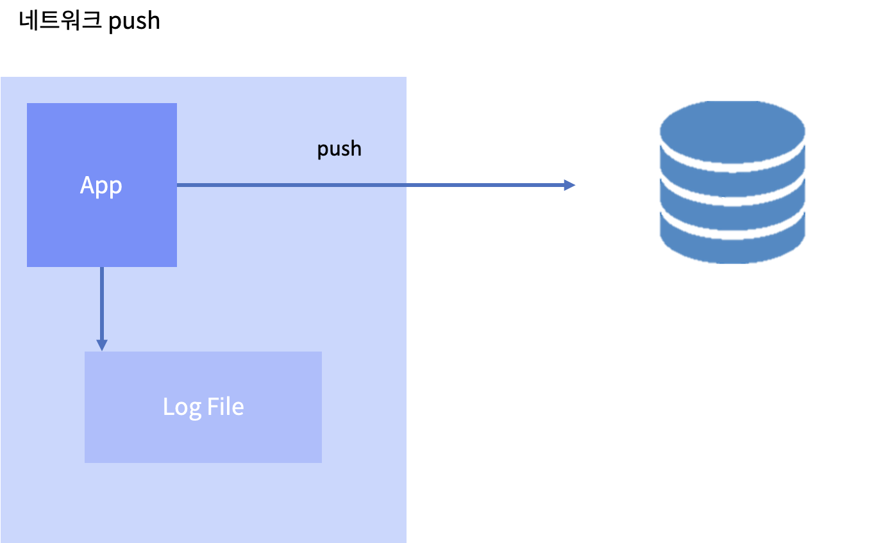
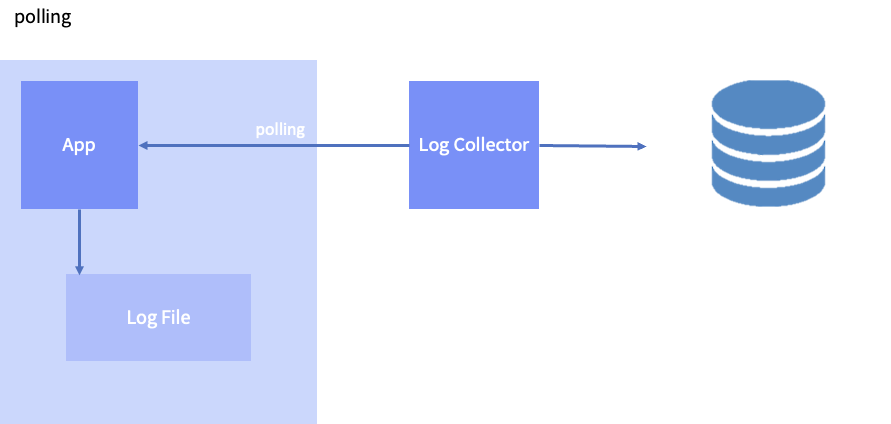
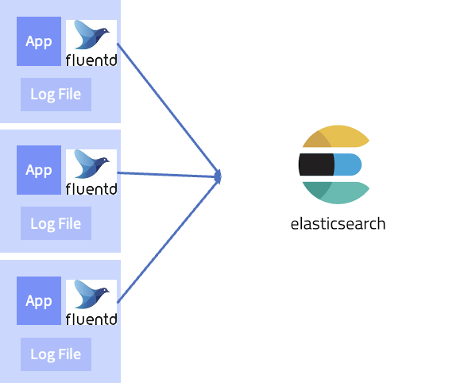
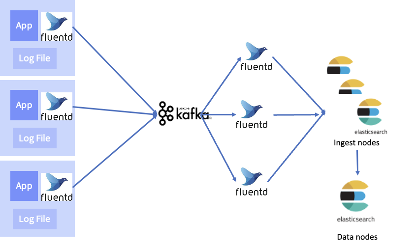

# EFK(ELK) STACK
## 로그란?
- Log란, 컴퓨터가 수행하는 도중 유의미한 내용을 파일로 남기는 기록
### 로그의 내용
1. 로그를 남긴 시간
2. 로그 레벨(심각성의 정도)
    - a. `TRACE` : 어플리케이션에서 어떤 상황이 일어나는지 상세한 내용을 보고 싶을때 남기기. 라이브러리의 내부 동작을 주로 TRACE로 남기는 경우가 많다
    - b. `DEBUG` : 디버깅 용도로 남기는 로그. 어플리케이션의 개발 단계에서 유의미한 정보르 주로 남긴다
    - C. ⭐⭐`INFO`⭐⭐ : 단순 정보를 남기는 용도
    - d. `WARN` : 시스템의 주요 기능을 제공 못하는 것은 아니지만, 반복해서 발생한다면 원인을 파악하거나 해소해야 하는 로그
    - e. `ERROR` : 시스템의 주요 기능을 제공 못하게 된 경우. 발생한 경우 빠르게 원인을 파악하거나 해소해야 하는 로그
    - f. `FATAL` : 시스템이 이용 불가능하게 된 경우
        - 예 : Memory, Crash, Disk full
3. 로그 내용
4. 로그가 발생한 위치(URL)
    - a. 로그를 남긴 패키지, 클래스의 정보는 필수로 남겨야 한다
    - b. 로그가 WARN, ERROR라면, 해당 로그가 발생한 코드의 위치(정확한 Line)를 알 수 있다면 문제점을 파악하는 데 도움이 많이 된다

## 로그를 수집하는 이유
- 로그가 파일에 남아있다면 문제가 될 때 찾아보면 되는데, 왜 수집이 필요할까?
    1. 시스템(HW)에 장애가 나면 로그파일에 다시 접근할 수 없을 수 있다
    2. 사용하는 프로그램이 많아지거나, 인스턴스의 수가 많다면 일일히 들어가서 확인하기 어렵다
    3. 필터링, 그룹 검색 등을 이용하여 로그를 활용하여 더 신뢰성 있는 시스템을 만들 수 있다

## 로그 수집 아키텍처파일을 이용한 수집
- 어플리케이션에서는 로그를 파일로만 남긴다. 따라서 별도로 파일로부터 수집해서 전송하는 프로세스를 만들어서 전송하는 방식이 사용된다

장점
- 어플리케이션과 로그 수집기가 관심사의 분리(SoC)가 된다. 아키텍쳐 상으로 역할과 동작이 구분되므로 유연성이 높아진다
- 컨테이너 환경을 이용해서 어플리케이션과 수집기의 리소스를 분리하면, 수집기 때문에 어플리케이션에 부하를 주지 않는다

단점
- 어플리케이션, 로그 수집기를 별도로 관리해야 한다
    - 어플리케이션은 정상인데, 로그 수집기의 이상으로 어플리케이션의 이상으로 판단 될 수 있다

### Network를 이용한 Push

**네트워크 push**

장점
- 로그 전송의 성공, 실패 여부플 애플리케이션에서 판단 가능

단점
- 어플리케이션의 로직과 로그 전송을 같은 process 에서 수행하므로 서로 영향을 미칠 수 있다
- 로그 전송 때문에 어플리케이션의 부하나 bottleneck이 있을 수 있다
    - bottleneck 이 무엇일지 궁금하다면, [bottleneck](https://m.blog.naver.com/kimjungsim89/221362850087)를 클릭!
- 문제를 디버깅하기 복잡해짐

### Network를 이용한 Polling
- 어플리케이션은 시스템의 정보, 로그 정보 등에 대해서 scrap 할 수 있는 채널(network port, path)만 열어두고, 수집기에서 주기적으로 Polling으로 scrap 하는 방식입니다. Log보다는 Metric(통계정보, 상태정보에 대한 snapshot) 수집에 더 더 적합하다

**Polling**

장점
- 어플리케이션과 메트릭에 수집에 대한 관심사의 분리(SoC) 가 이루어진다
- 어플리케이션에서 개발자가 수집에 대한 관리를 할 필요 없음
- 분산 환경, 컨테이너 환경, 자동화된 인프라 환경에서 사용성이 편하고, 확장성이 높다

단점
- Polling 주기나 Scrap 시점에 따라 값이 바뀌므로 특정 순간의 정확한 정보를 보는데는 적합하지 않는다

## EFK 로그 수집 Architecture
Elastic Search, Fluentd, Kibana 의 앞자를 따서 EFK
- Elastic Search으로 구성된 ELK라는 용어로 더 잘 알려짐
- Elastic stack은 유료화로 인해, ElasticSearch 대신 Opensearch를, Kibana 대신 Opendashboard를 사용한다

### Fluentd
- **Fluentd 가 로그의 수집, 파싱, 전송을 맡는다.** 
- 어플리케이션의 파일을 읽기 위해 어플리케이션과 같은 호스트에 뜬다.
- 적은 리소스를 사용하면서 로그를 파싱하고 전송하는데 특화
- 규칙을 태그방식으로 정하기 때문에 사용성이 직관적
- CRuby로 만들어졌다
    - Fluentbit이라는 C기반의 경량화된 버전도 있다. 이것은 forwarder로서 사용하게 적합하다

### Opensearch(Elasticseach)
- **로그를 저장하는 저장소**
- 텍스트 데이터의 검색에 특화된 인덱싱 방법을 가지고 있기 때문에, 로그의 저장소 겸 검색 시스템으로 사용하기 좋다
- 미리 스키마를 선언하지 않더라도 저장된 데이터 형식에 맞게 자동으로 인덱싱 할 수 있는 것 또한 장점이다
- 로그는 다양한 시스템에서 다양한 목적으로 남기 때문에 로그 저장소는 데이터 타입과 형식에 대한 유연성을 제공하는 것을 선택해야 한다.
- Jaba로 만들어졌으며, JVM 위에서 돌아간다

### Open Dashboard(Kibana)
- Opensearch와 연동되고, 사용하기 쉬운 **시각화 도구**
- 기본적으로 timeline 방식의 로그 시각화를 제공하고, SQL을 모르더라도 UI를 통해서 원하는 로그를 쉽게 찾고 추이를 볼 수 있다
- 검색 결과에 대한 link를 생성해서 빠르게 공유할 수 있다
- 이미 데이터가 Opensearch에 쌓여있다면, 다양한 그래프를 작성하고 통합된 Dashboard로 구성할 수 있다
- Javascript로 만들어졌고, Nodejs 서버로 동작한다

## 요구사항에 따른 구성방법

### 작은 규모의 서비스
수집기(fluentd)에서 바로 storage(Opensearch)로 전송하는 것이 구성이 간단하고, 비용도 적게 나가는 이점이 있다. 기본 아키텍쳐는 동일

### 로그 수집기에 부하가 있을 때
다음의 경우 로그 수집이 지연되거나 로그가 유실될 수 있으므로 대책이 필요
- 실시간으로 쌓이는 로그의 양이 수집기가 처리할 수 있는 양보다 많은 경우
- 수집에서 처리하는 파싱 로직이 부족할 때
- 로그 수집기의 리소스가 처리하는 작업에 비해서 부족할 때
로그 수집기에 부하가 있다면, 역할을 나눠주는 것이 좋다

### Fluentd를 forwarder 와 collector 로 나누기 (여기서 부턴 전문가 수준의 이해도가 필요하므로 추후에 경력 쌓고 다시 보면 이해 짱 될듯?)
Forwarder
- 각 노드(또는 인스턴스)에서 fluend 는 최소한의 Parsing 과 전송만 한다
Collector
- Forwarder 에 의해 전달된 로그를 파싱하고, 적절한 스토리지로 전송
- 인스턴스 수를 늘리거나 줄이면서 로그의 유입량의 변화와 부하에 대응 할 수 있다

    

### 저장소에서 트래픽을 받아주지 못할 때

- 로그 수집가들은 모두 정상 작동하지만, 저장소에서 실시간으로 저장요청이 너무 많으면 저장하고 인덱싱하는데 걸리는 시간이 많이 걸려서 Storage가 bottleneck 이 될 수도 있다. 이런 경우에 Storage API 에서 Error 를 받게 되면, 로그 수집기에서 무한 재시도 또는 쌓여있는 로그 때문에 buffer full로 인해서 부하가 커지거나 로그가 유실 될 수 있다
- 이때 스토리지에서 저장의 효율을 높여주는 시스템이 있다면 대응 가능!
    - Opensearch에서는 ingest node 라는 서버로 그 역할을 할 수 있다
        - ingest node의 수를 늘려서 대량의 저장요청에 대응 할 수 있다

