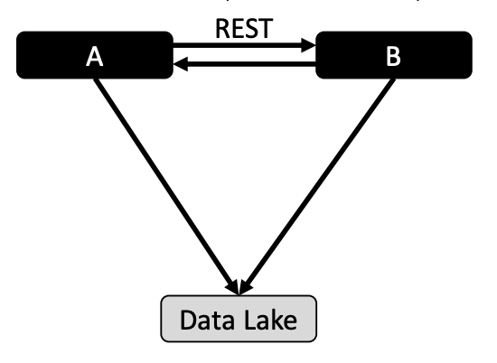
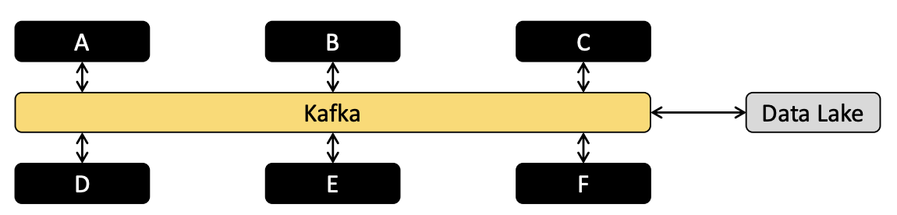

# Kafka 개념~~(스타레일 카프카눈나 아님 ㅋㅋ)~~

## 전통적인 데이터 처리 방식(카프카 이전 방식)

- 시스템 A가 시스템 B에 데이터를 요청할 때 **동기적** 으로 요청합니다. 즉, 요청(Request) 후 응답(Response)를 기다리는 RESTful API를 사용하는 방식이 대표적인 방식이었다

- **하지만!** 비동기적으로 데이터를 받을 때는 `RabbitMQ` 같은 Message Queue 또는 배치 처리 방식을 사용하였으며, 이렇게 쌓여진 데이터들은 모두 Data Lake에 적재 될 수 있었다

- **그런데!** 이 때 시스템 C가 추가된다면 시스템 C 역시 다른 시스템들과의 연결고리가 필요하게 되고, Data Lake로의 파이프라인이 추가된다

    - 이렇게 시스템이 여러개 추가 되면 되게 복잡해지며, 이러한 상황에 더하여 시스템 별 통신 프로토콜이 다르다면 여러 통신 프로토콜을 지원하도록 각각의 시스템 별 구현이 필요하고(벌써부터 어지럽죠잉?), 데이터의 포맷도 다를 수 있다(헉...ㄷㄷ) 이러한 복잡성 때문에 POF(Point Of Failure) 가 많아지게 된다.

    - 하지만 더 큰 문제는 시스템을 엮으면 엮을 수록 전체 시스템에 대한 신뢰도 또한 보장할 수 없다는 점이다. 또한 어디서 어떤 장애가 발생했는지에 대한 모니터링도 힘듬...

- **그래서** 이러한 문제점을 해결 해주는 해결사로 여러가지 플랫폼이 등장하였으며 가장 대표적인 플랫폼이 **Kafka** 이다.

## kafka를 이용한 아키텍쳐

- 위 그림 처럼 카프카는 각 시스템 별 의존성 제거 하고, 수집에 대한 파이프라인을 오로지 카프카를 통과해 Data Lake에 적재한다. 
- 따라서 시스템 간 의존성을 카프카를 통해 간접적으로 가지게된다. 이렇게 직접 시스템간 연결이 아닌 카프카를 통해 연결되기 때문에 시스템에 대한 확장을 굉장히 쉽게 할 수 있다는 것이 가장 큰 장점이다!
- 새로운 시스템 G,H,I 등등 여러 시스템을 추가해도 카프카와만 연결 되어있기 때문에 시스템에 대한 신뢰도도 각 머신의 신뢰도를 유지한 채로 시스템을 구축 할 수 있다.
- 또한 카프카를 이용해 각 시스템의 통신 프로토콜을 통합하기도 쉬워진다.

## ⭐⭐⭐Kafka 대표적인 구성요소⭐⭐⭐
- 대표적인 구성요서로 `Producer`, `Topic`, `Consumer` 가 있다.

- `Topic`
    - 카프카 안에서 전송되는 메시지가 저장되는 저장소를 논리적으로 표현하는 개념
    - 시스템 상 파일이나 디렉토리 형식으로 확인하는 것 불가능(가상의공간 같은 느낌)
- `Producer`
    - 메시지를 생산(Produce) 해서 카프카의 Topic으로 보내는 애플리케이션
- `Consumer`
    - 카프카 토픽 내에 들어있는 메시지를 가져와서 소비(Consume) 하는 애플리케이션
    - 컨슈머 그룹은 토픽의 메시지를 소비하기 위해 협력하는 Consumer들의 집합
    - 하나의 컨슈머는 하나의 컨슈머 그룹에 포함되며, 하나의 컨슈머 그룹에 포함되어 있는 여러 컨슈머들은 협력하여 **토픽의 메시지를 분산 병렬 처리** 할 수 있게 해준다.

- 쉽게 말해서, Producer 에서 데이터를 생산해서 Topic으로 보내고 Consumer가 Topic에 있는 메시지를 가져와서 사용하는 방식

## Kafka 내부 구성요소와 아키텍쳐

- Broker
    - 서버라고도 하며, 토픽을 서빙하는 주체
    - Producer 와 Consumer는 이 브로커에 접속해 원하는 토픽에 데이터를 Produce하거나 Consume 한다
- 파티션
    - 토픽은 파티션으로 각각 나뉘며, 실제 디스크에 저장되는 기준
    - 개념적으로는 데이터를 저장하는 개념인 토픽과 같지만 다른게 **실제 메시지가 위치하는 공간**

- 컨슈머 그룹
    - 컨슈머들이 모인 그룹
    - 하나의 컨슈머 그룹은 하나 이상의 컨슈머를 가질 수 있다
    - 일반적으로 많은 데이터가 한꺼번에 프로듀서에 의해 쏟아져 오는 경우 이를 여러 컨슈머로 처리하기 위해 사용

- 클러스터 구성
    - 카프카는 고가용성 확장성을 위해 브로커가 여러 개로 나뉘어서 하나의 토픽을 서빙 할 수 있다
    - 하나의 브로커에 여러 토픽이 존재 할 수 있고, 반대로 토픽이 여러 브로커에 생길 수 있다

- Zookeeper
    - 컨슈머와 통신, 각종 분산 시스템에 대한 메타 데이터 정보의 저장을 담당 
        - > `분산 코디네이션`

- 분산 코디네이션
    - 분산 환경에서의 시스템간의 정보 공유, 상태 확인, 서버 동기화의 기능을 제공
    - 분산 시스템의 일부이기 때문에 동작을 멈추게 된다면 분산 환경의 시스템에 영향을 미친다
        - 이를 위해 주키퍼 또한 클러스터로 구성되며, 보통 홀수로 구성되게 된다. 왜냐하면, 서버에 문제가 생겼을 경우 과반수가 가진 데이터를 기준으로 일관성을 유지해야 하기 때문이다
            - 보통은 최소 3대, 5 이상의 홀수로 구성하는 것이 일반적

- Kafka with Zookeeper
카프카에서 주키퍼 관리하는 3가지 방법
  1. 클러스터 관리 : 클러스터에 존재하는 브로커를 관리하고 모니터링한다
  2. 토픽 관리 : 토픽 리스트를 관리하고 토픽에 할당된 파티션과 Replication을 관리한다
  3. 파티션 리더 관리 : 파티션의 리더가 될 브로커를 선택하고, 리더가 다운될 경우 다음 리더를 선출한다
  - 브로커들끼리 서로를 발견할 수 있도록 정보를 전달한다

