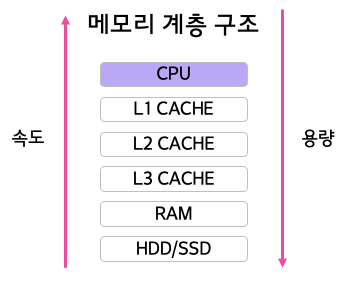
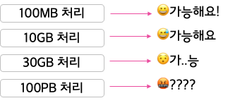
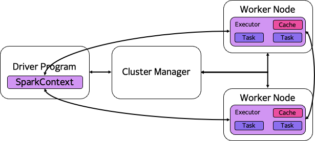
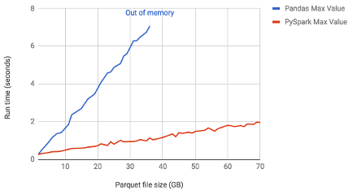
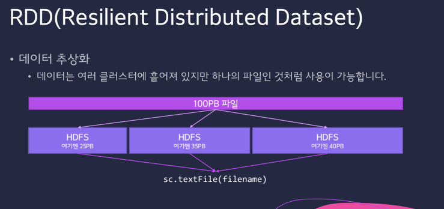
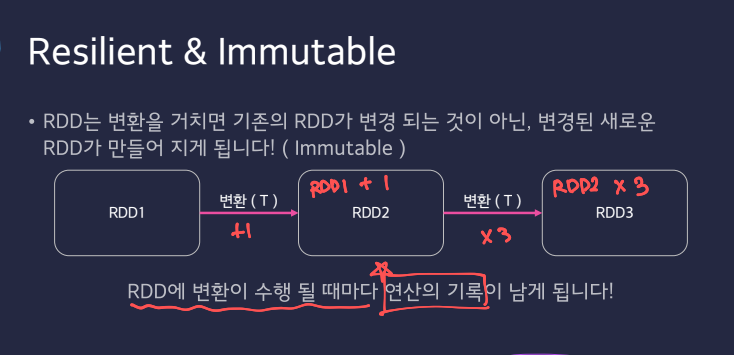

# Spark
## Spark 왜 in-memory 연산을 하는 이유
- 스파크는 반복적인 처리가 필요한 작업에서 속도가 하둡보다 몇배는 빠르기 때문이다

- 컴퓨터의 연산작업이 시작되면, HDD/SSD로부터 CPU 까지 데이터가 이동한다.
- 연산에 자주 사용되는 데이터는 위쪽에 저장(CPU가 자주 접근)되고 연산에 자주 사용되지 않는 데이터는 아래쪽에 저장된다.

- 즉, 스파크는 메모리 계층구조를 통해 데이터를 관리하고 이를 효율적으로 활용한다. 데이터가 RAM에 올라가면 빠른 속도로 처리되지만, 필요에 따라 디스크로 쓰여질 수도 있다. 이러한 메모리 계층 구조를 통해 스파크는 데이터 처리 속도를 최적화 할 수 있다

    

- 위 그림처럼 밑으로 내려갈 수록 속도의 차이가 매우 나며, L1,L2 캐시는 빠르기는 하지만 용량이 매우 작다

- 가격도 적당하고, 용량도 적당하며, 속도도 적당히 빠른 RAM을 스파크에서 활용한다.
    - RAM은 디스크에 비해 훨씬 빠르며, 이는 데이터에 대한 빠른 엑세스와 처리를 가능하게 하는데 이것이 스파크의 주요 강점 중 하나이다. 반복적인 연산 작업에서 RAM에서 데이터를 처리하면 디스크에 접근하는 것보다 훨씬 효율적으로 작업을 수행 할 수 있다

## Spark Cluster
- RAM 을 사용하는 스파크도 문제가 있다면 거대한 용량의 데이터는 처리하기 힘들다는 것
    

    - 위 그림처럼 거대한 용량을 가진 데이터는 RAM에서 단독으로 처리하기 힘들기 때문에 DISK 및 분산 처리 시스템과의 협업을 할 수 있다
    - 따라서 스파크도 클러스터를 이루게 된다 (스파크와 하둡은 평생친구~)

마찬가지로 Master/Worker 구조를 가지고 있으며, SparkContext가 바로 Master의 역할이다
- Driver Program
    - 분산 시스템이서 처리할 작업을 의미, 즉 작업 프로그램(Task Program)을 작성해서 실행을 의뢰하는 주체로서 Python, Scalar, Java 등을 사용해서 프로그램을 작성한다
    - 실행은 각 Worker Node 에서 실행된다
- Cluster Manager
    - Worker Node의 상태를 관리하는 주체로서 스케쥴링을 담당
    - 작성된 Task를 Worker에 분배하는 역할
    - 하둡에는 YARN, AWS에는 EMR(Elastic Map Reduce) 와 같은 역할
- Worker Node
    - 실제 작업하는 노드
    - Cluster Manager에 의해 Driver Program을 다운로드 받고 실행한다
    - 노드의 개수는 필요에 따라 얼마든지 늘릴 수 있으며, 이상적인 구조는 하나의 CPU 당 하나의 노드를 배치 하는 것

## Pandas VS Spark

- 일반 로컬 컴퓨터에서 스파크를 사용하면 Pandas의 데이터 프레임보다 느리다
    - 데이터 프레임은 일정 파일 크기가 넘어가면 Out of Memory 오류가 나면서 연산이 불가능하다
        - 하지만 스파크는 용량이 커져도 연산을 수행한다
        - 스파크는 대용량 데이터에 대한 수평적 확장성을 고려했기 때문이다
- 하지만 스파크는 하둡이나 하이브의 맵리듀스 작업보다 훨씬 빠르다
    - 메모리상에서는 100배, 디스크 상에서는 10배
- 스파크가 빠른 이유는 `Lazy Evaluation` 연산을 지원하기 때문이다
    - `Lazy Evaluation` 은?
        - 데이터를 바로 처리하는 것이 아니라, 데이터를 불러오는 것부터 시작하여 필요한 시점에서 연산을 수행한다.
            - 이를 통해, 데이터 로딩과 중복 연산을 방지하고, 연산 처리 속도를 빠르게 한다.

## RDD (Resilient Distributed Dataset) 개요
### 스파크의 핵심 데이터 모델
- Resilient Distributed Dataset(RDD)
    - 탄력적 분산 데이터 세트
    - 여러 분산된 노드에 걸쳐서 저장 됨
    - 변경이 불가능
    - 여러 개의 파티션으로 분리 될 수 있음

- 위 그림에서 생각보다 많이 일어나는 장애 상황은
    - 데이터가 여러 곳에서 연산되는데 여러 노드 중 하나가 망가지거나
    - 네트워크 장애, 하드웨어 / 메모리 문제 / 기타 등등의 문제로 인해 연산이 불가능한 상황이 발생됐을 때

        - 데이터가 불변(immutable) 하면 문제가 발생 됐을 때 복원이 가능하다!

### Resilient & Immutable
- RDD는 변환을 거치면 기존의 RDD가 변경 되는 것이 아닌, 변경된 새로운 RDD가 만들어 지게 된다!(Immutable)

- RDD에 변환이 수행 될 때마다 **연산의 기록** 이 남게 된다!!
    - 따라서 RDD의 변환 과정은 비 순환 그래프(Acyclic Graph)로 그릴 수 있다. 이러한 특징 덕분에 문제가 생기면 이전 RDD로 돌아갈 수 있게 된다
        - 비 순환 그래프 = DAG
            - DAG 특징
                - 항상 시작과 끝이 존재한다

### RDD (Resilient Distributed Dataset)
- Type Safe 특징
    - 코드를 작성하고 컴파일 도중에 데이터의 타입을 판별 할 수 있어 문제를 일찍 발견할 수 있다(개발자 친화적)
- 다양한 데이터 구조 지원
    - Unstructured Data, Structured Data 모두 담아 낼 수 있다
- 게으른 연산
    - 결과가 필요할 때까지 연산을 하지 않고 기다린다(Lazy)

    

    - T : (Transformation - 변환)
    - A : (Action - 액션)
        - Action을 수행 할 때까지는 Transformation은 실행 되지 않는다
        - Action을 만나면 실행되지않았던 모든 Transformation이 전부 실행된다
            - 이를 게으른 연산(Lazy Evaluation) 이라고 한다

### Spark Operation
- 스파크의 연산은 다음과 같이 크게 두가지로 구분이 될 수 있다

    - Transformations + Actions