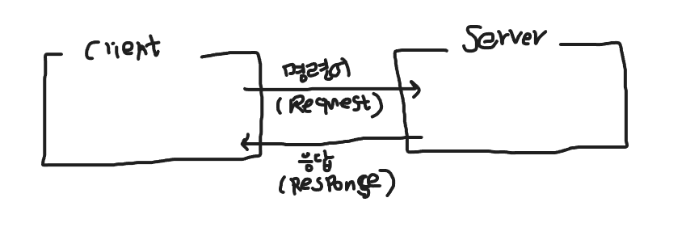
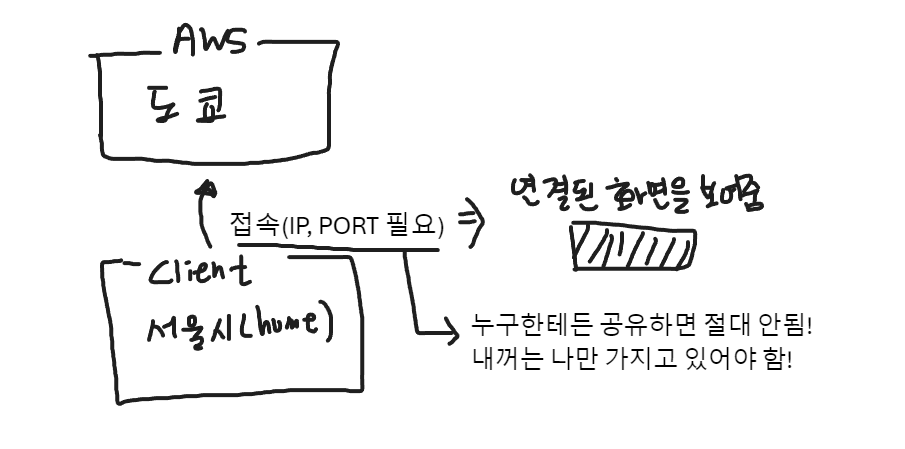

# 데이터 엔지니어링
- 데이터를 처리하는 기술
    - 이론 -> 전처리(null), 스케일링 등
    - 공학 -> Bigdata 처리, 로그처리, 실시간/배치 처리, 스케일링, Pipeline 구축

- 프로젝트를 잘하기 위해서는 **Web** 을 잘써야 함
    - **Web** 으로 DE, DS, DA 등 다 할 수 있음.

## AWS, Network 기초

- 

1. 네트워크 상의 물리적인 주소 -> IP 주소(HOST)
2. 서비스번호(POST)

    - 예시 | 명령프롬포트 실행 > ping naver.com(도메인) > [223, 130, 192, 247]
        - > 저거랑 같은 수많은 도메인을 외우기에는 까다로운게 있음
            - 이것을 해결하는 방법은 클라우드 서비스를 제공 받는 거임

## AWS(Amazon Web Service) 
- 클라우드 서비스 제공

- 클라우드 서비스 등장 전 : On Promise 구조 (예:서버실)
    - 서버실은 관리가 빡세고 비용도 너무 많이 듬.

- 클라우드 서비스를 이용해서 이러한 단점을 보완!

## 우리가 클라우드를 대하는 자세

- 

- IP, PORT를 보호하는 프로그램 : SSH

- SSh?
    - AWS에 들어가게 해줄 열쇠(Key File) 제공 : PEM 파일
    - PEM 파일은 절대로 드라이브, 깃허브로 올리면 안된다!
        - 올리는 순간 과징금 뿐 아니라 인생이 큰일 날 수 있다!!!