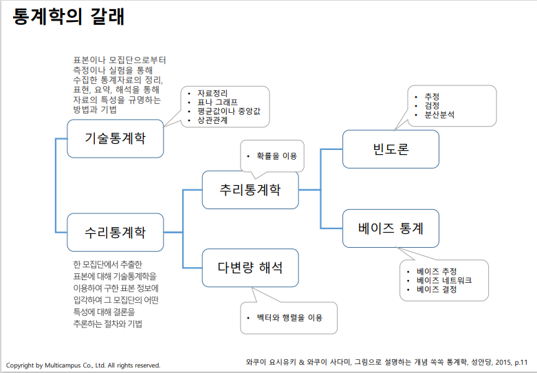
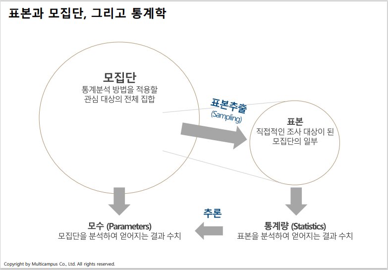
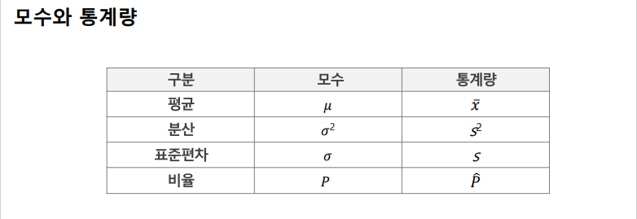
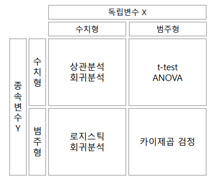
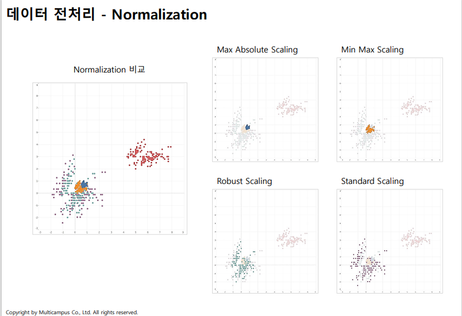
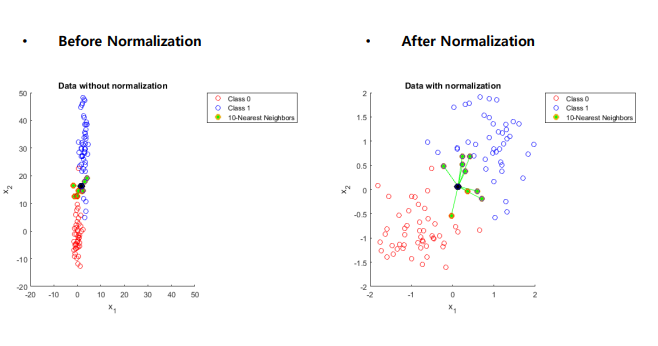
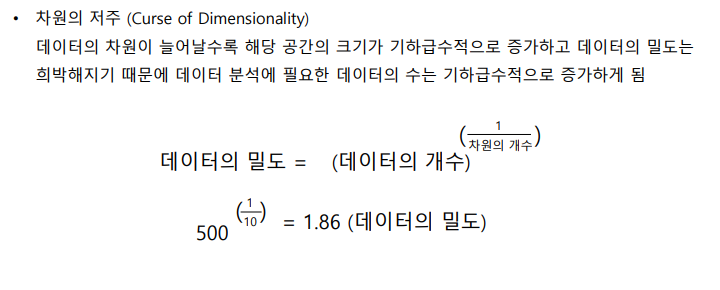
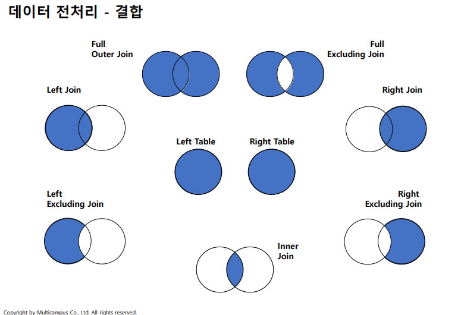

# 통계 및 머신러닝 기초

## 1. 데이터의 획득과 정리

### 1-1. 통계와 통계학
- 통계란?
    - 사람, 사물-사건, 사회적 현상 혹은 자연 현상 등을 조사해 수집된 각종 데이터의 요약
- 통계학이란?
    - 산술적 방법으로, 주로 다량의 데이터를 관찰하고 정리 및 분석하는 방법을 연구하는 수학의 한 분야
### 1-2 통계학의 목적
- 학문의 관점
    - 새로운 질문들, 연구 과제에 대해 과학적으로 답을 찾는 방법
- 비즈니스 관점
    - 성공 가능성을 높이거나 실패 가능성을 낮춤
    - 넘치는 데이터로부터 인사이트를 얻는 방법을 제공
    - 빅데이터와 인공지능 시대의 기본 학문
### 1-3 통계학의 갈래
- 
### 1-4 표본과 모집단, 그리고 통계학
- 
### 1-5 모수와 통계랑
- 

## 2. 표본 추출과 자료 정리

### 2-1. 표본추출(Sampling)
- 단순 무작위 추출(Simple Random Sampling)
    - 전체에 대해 무작위 추출
- 층화 추출(Stratified Random Sampling)
    - 데이터 내에서 지정한 그룹 별로 지정한 비율 만큼의 데이터를 랜덤하게 선택
    - 모집단의 각 층의 비율만큼 추출
- 계통 추출(Systematic Sampling)
    - 첫 번째 요소는 무작위로 선정, 목록의 매 k번째 요소를 표본으로 선정하는 표집 방법
    - 모집단의 크기를 원하는 표본의 크기로 나누어 k를 계산(k는 표집 간격)
    - 만약 요소들의 목록이 표본이 추출되기 전에 무작위로 되어 있다면, 그 목록에서 계통추출법을 통해 추출된 표본은 실제로는 단순임의 표본과 같다고 할 수 있다.
    - 만약 표본이 추출되기 전 요소들의 목록이 무작위로 되어 있지 않고 주기성을 띄고 있다면, 계통추출법을 통해 추출된 표본은 매우 어긋난 표본이 될 수 있으며 모집단을 전혀 반영하지 못하게 됨
- 군집 추출(Cluster Sampling)
    - 소집단 자체를 표본대상으로 하기 때문에 각 소집단이 가능한 한 모집단을 대표할 수 있는 소규모의 집단이 되어야만 가장 이상적이다
        - 장점
            - 군집을 잘 규정하면 비용이 절감
            - 군집의 특성을 평가하고 모집단의 특성과 비교 가능
        - 단점
            - 단순임의추출법보다 군집을 과대 또는 과소평가해서 표본 오차를 계산하기 어려울 수 있음

### 2-2. 데이터 Type 별 통계 분석
- 변수의 타입과 역할에 따라 다른 분석 기법 적용
    - 
### 2-3 자료의 정리방법
- 통계표
- 도수분포표
- 상대도수
- 히스토그램

## 3. 데이터 전처리

### 3-1. 데이터 전처리
- 데이터 분석 작업 전에 데이터를 분석하기 좋은 형태로 만드는 과정을 총칭하는 개념
- 데이터 품질을 낮추는 주요 원인
    1. 불완전(Incomplete) : 데이터의 필드가 비어있는 경우
    2. 잡음(Noise) : 데이터의 오류가 포함된 경우
    3. 모순(Inconsistency) : 데이터 간 정합성, 일관성이 결여된 경우
- 데이터 전처리 주요 기법
    1. 정제(Cleaning)
    2. 통합(Integration)
    3. 축소(Reduction)
    4. 변환(Transformation)
- 결측값 (Missing Value)
    - 존재하지 않고 비어있는 상태(값이 없는거)
    - DB에서 Null 값
    - 후속 분석 결과에 영향이 최소화 되도록 데이터를 채우거나 없앨 필요 있음
- 결측값 처리 방법
    - 수작업으로 채워 넣기
    - 특정값 사용
    - 평균값 사용
    - 가장 가능성이 높은 값 사용(회귀분석, 보간법 등)
    - 해당 데이터 행을 모두 제거
- 이상값(Outlier)
    - 대표적인 잡음 요소
    - 아주 드물게 나타나는 특이값, 오류
- 이상값 탐지 방법
    - 수치적 탐지방법
        - IQR 기준
        - Z-Score
    - 확률이나 분포를 이용
    - 기계학습 기법을 활용

### 3-2. 데이터 전처리 - Normalization
- Normalization (정규화)
    - 단위 차이, 극단값 등으로 비교 어렵거나 왜곡 발생시, 표준화하여 비교 가능하게 만드는 방법
- 대표적인 정규화 방법
    - Min-Max Scaling
    - Standard Scaling
    - Max Absolute Scaling
    - Robust Scaling
- 
- 왜 정규화를 할까?
    - 정규화를 적용하지 않는 경우, 외형적으로 보이는 __그대로__ 의 결과를 얻게 될 경우가 많으며, 이로 인하여 왜곡된 결론을 얻는 경우도 있음
    - 예시
        - 

### 3-3. 데이터 전처리 - Noise
- 기타 잡음 요소
    - 개채의 식별
        - 동일한 데이터가 다른 이름으로 존재 할 때 또는 동일한 이름의 데이터가 있을 때, 어떻게 동일한 데이터임을 확인 할까?
        - 동일한 내용을 다른 형태로 저장하고 있다면 어떤 기준으로 변환, 통합 해야 할까?
    - 중복
        - 중복 데이터 제거 -> 중복인가 아닌가를 판단하는 룰
        - 유도 속성과 이에 의한 오류 (예) 월소득/년소득, 생년월일/나이
        - DB의 정규화 vs 비정규화
        - 상관분석
    - 동일 데이터에 대한 속성값 차이
        - 표현, 척도, 부호 등의 차이
        - 데이터 레벨의 차이
### 3-4. 데이터 전처리 - 축소
- Sampling
    - 데이터의 양이 너무 많아 분석의 어려움이 있거나 시간 관점에서 현실적이지 않을 때,분석에 적절하게 조절
- 차원 축소
    - 

### 데이터 전처리 - 결합(Join)
- 관계형 데이터 모델
    - 데이터의 중복을 피하면서 정합성을 유지하기 위한 데이터 모델
    - 2차원 구조의 테이블 형태로 자료를 표현
- 결합 (Join)
    - 테이블 구조를 가진 데이터 간에 공통 요소 (컬럼 혹은 변수) 기준으로 둘 혹은 그 이상의 데이터 테이블을 합하여 하나의 데이터로 만드는 것
    - 
<!-- ## 중심극한정리
- 표뵨의 수가 무한히 크다면, 이 "표본들의 평균" 이 보여주는 확률 분포
    -  -->