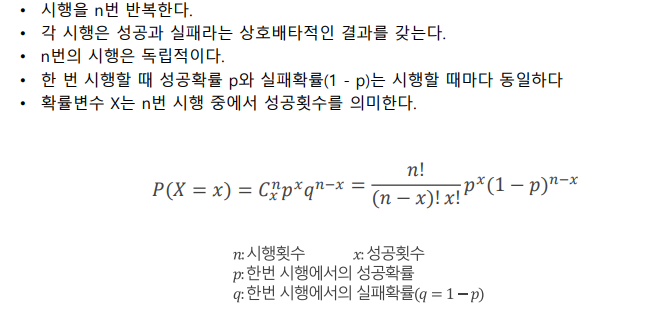

# 확률과 분포

## 1-1 확률 기초

### 주요 확률 분포
- 

### 균등 분포 (Uniform Distribution)
- 확률분포 함수가 정의된 모든 곳에서 값이 일정한 분포
    - 이산확률변수인경우, 확률질량함수(pmf) = 1/k,  x = x1, x2 ...,xk
    - 연속확률변수인경우, 확률밀도함수(pdf) = 1/ (b-a),  a <= x <= b

### 이항분포 (Binomial Distribution)
- 베르누이 실험 또는 베르누이 시행에 기초하고 있으며 베르누이 시행을 n번 반복하면 이항실험이 됨
- 이항분포, 포아송분포, 초기하분포가 이항분포 해당
- 조건
    - 

### 포아송분포 (Poisson Distribution)
- 일정한 단위시간,거리,면적과 같이 어떤 구간에서 어떤 사건이 랜덤하게 발생하는 경우 사용되는 이산형 확률분포
- 적용 조건
    - 구간마다 발생하는 사상은 서로 독립적
    - 사상의 발생확률은 구간의 길이에 비례
    - 아주 작은 구간에서 사상이 발생할 확률은 무시
    - 구간마다 확률분포는 일정
- 활용 예
    - 1시간 동안 은행에 방문하는 고객의 수
    - 1시간 동안 콜센터로 걸려오는 전화의 수
    - 책 1페이당 오탈자가 발생하는 건수
    - 반도체 웨이퍼 25장 당 불량 건수
- 포아송분포 함수 / 기대값과 분산
    - 

### 지수분포 (Exponential Distribution)
- 사건이 서로 독립일 때, 일정 시간 동안 발생하는 사건의 횟수가 포아송 분포를 따른다면, 다음 사건이 일어날 때까지의 대기시간
- 항상 양의 값
- 

### 정규 분포 (Normal Distribution)
- 연속확률변수를 기술하는 가장 중요한 확률분포
- 사회현상이나 자연현상의 실제응용에 있어 폭넓게 사용
- 연속확률변수의 측정으로 얻는 많은 표본을 그린 히스토그램 정규곡선(normal curve) 라고 하는데, 연속확률분포의 형태가 종같이 보이는 부드러운 곡선임을 의미
- 정규곡선은 정규분포의 확률밀도함수에 의해서 결정
- 정규분포의 특성
    - 

### t 분포 (Student's t-Distribution)
- 

- 

### 카이제곱 분포 (Chi-squared Distribution)
- 카이제곱을 X라고 함, 즉 X 제곱분포이고 분산을 추정할 때 사용
- 

- 

### F 분포 (F Distribution)
- 

### 분포간의 관계
- 표본평균, 표본분산으로 정의되는 확률번수들로써, 표본의 수가 많아질수록 중심극한정리에 의해 결국 정규분포에 수렴
    - 여기서 중심극한정리란?
        - (중심극한정리)[https://drhongdatanote.tistory.com/57]

### 분포의 요약
- 