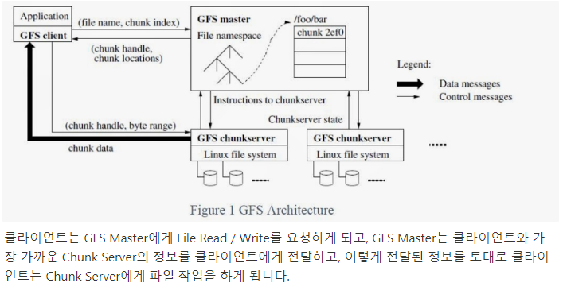
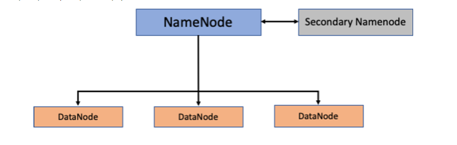
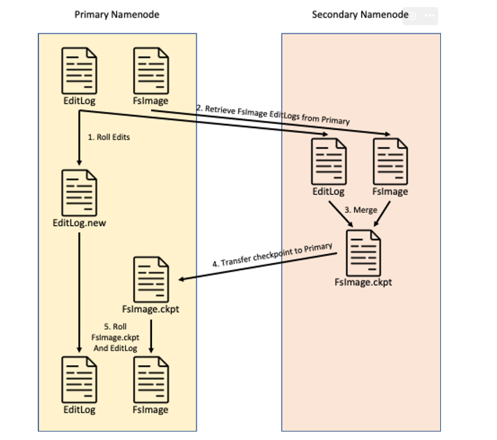
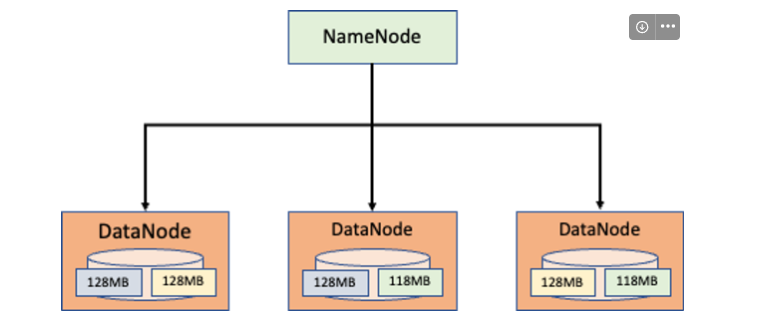
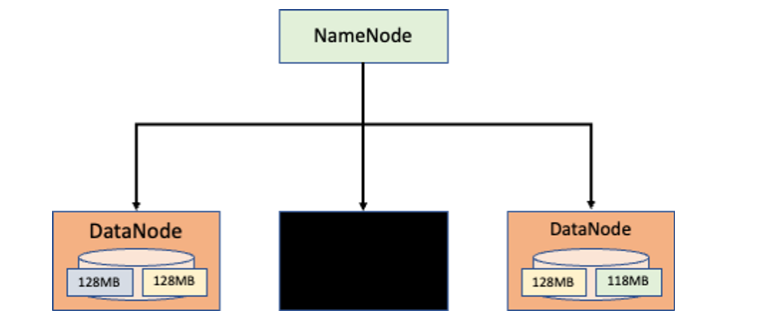
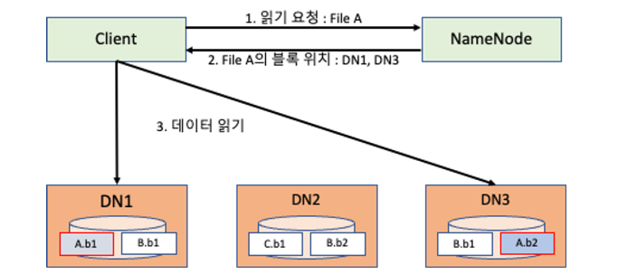
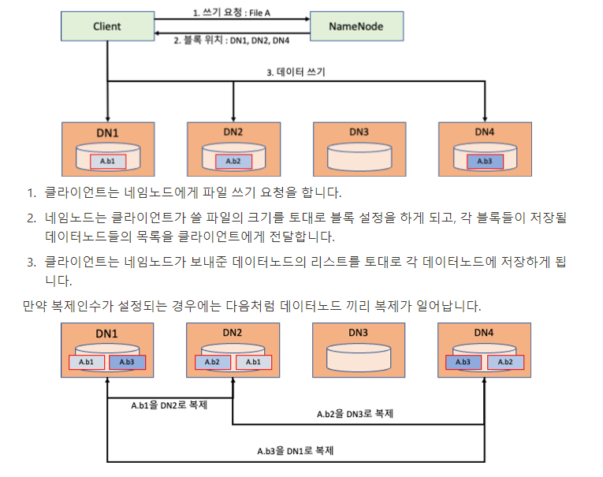

# Hadoop HDFS(Hardoop Distributed File System)

## HDFS(분산 파일 시스템)
- 네트워크로 연결된 여러 머신의 스토리지를 관리하는 파일 시스템
    - 일반적으로 사용하는 컴퓨터도 파일 시스템을 가지고 있지만, 분산 파일 시스템은 여러 컴퓨터의 파일 시스템을 엮어서 관리하기 때문에 보다 복잡하다!

- 네트워크 기반이다 보니 네트워크에서 문제가 발생 할 수 있고, 여러 머신 들 중 하나의 머신에 장애가 발생 할 수 있다.

- 즉, 분산 파일 시스템은 하나의 머신에서 장애가 발생하더라도 데이터가 유실되지 않도록 견고한 파일 시스템을 유지하여야 한다.

## GFS
- 하둡 분산 파일 시스템(HDFS)의 모태가 되는 구조
    - 가장 큰 특징으로 Master / Worker 구조를 제안했으며 GFS Master 와 Worker의 역할을 하는 Chunk Server가 있다

## HDFS(Hardoop Distributed File System)
- 범용 하드웨어르 사용하여 분산 파일 시스템 구성
    - 클러스터 내에 분산 파일 시스템을 구성, 비싼 서버 대신 일반적인 범용 컴퓨터로도 저렴한 가격에 분산 파일 시스템을 구성 할 수 있다.
    - 블록 단위 저장
    - 마스터/워커 구조
    - 장애 허용 시스템(Fault Tolerance, 내고장성) 제공
        - 데이터 복제(Replication)을 제공하여 네트워크나 워커에 장애가 발생하더라도 계속해서 서비스를 제공할 수 있다
    - 확장성 제공
        - 하드웨어를 추가하면 용량이 선형적으로 그대로 증가하는 선형적인 확장성 제공
### HDFS Block
- HDFS에서 파일을 저장하는 단위
- 블록을 이용해 하나의 거대한 파일을 여러개의 블록으로 저장
- 하둡은 일반적인 분산 시스템보다 훨씬 큰 볼럭 사이즈인 128MB를 갖는다.(하둡1은64MB)
    - 실무에서는 128MB보다 더 큰 볼록 사이즈를 갖는 경우 있음

- 블록 단위로 파일을 처리함으로서 파일 하나의 크기가 실제 하나의 물리 디스크 사이즈보다 큰 경우 에도 저장하는 것이 가능하다.
    - 예를들어, 1TB짜리 하드 디스크에는 1TB까지만 저장할 수 있지만, 분산 파일 시스템에서블록 단위로 저장되기 때문에 1TB를 초과하는 파일이 여러 클러스터에 걸쳐 블록으로 쪼개져서 저장 될 수 있다.
    - 또한, 스토리지 관리가 단순화 된다. 블록 단위로 저장되기 때문에 각 디스크에 저장 할 수 있는 블록 수도 손쉽게 알아 낼 수 있고, 내고장성과 가용성을 지원하는 복제 기능 지원에 매우 적합하다.

## Namenode & Datanode

### Namenode
- 주요 역할은 메타데이터 관리와 데이터 노드 관리
- 네임노드의 메타데이터는 어떤 데이터노드에 어떤 블록이 들어 있는지에 대한 정보가 주를 이룬다.
- 메타데이터의 종류
    - FsImage(파일 시스템 이미지) : 블록의 네임스페이스를 포함한 데이터 블록 등 데이터의 모든 정보
    - EditLog : 데이터노드에서 발생한 데이터 변환 내역, HDFS의 **파일 생성, 삭제, 수정,** 트랜잭션 등에 대한 모든 정보
- 네임노드에서는 데이터노드를 관리함
    - 데이터노드는 일정 주기마다 네임노드에게 자신의 상태를 알리는 HeartBeat Packet(죽었는지 살았는지) 을 전송한다. 이 HeartBeat Packet 을 통해 네임노드에서 데이터 노드의 상태를 알 수 있다.
    - 또한 데이터노드는 네임노드에게 블록 리포트도 전송하여 어떤 파일 작업이 일어났는지도 보고하게 되어 있다.

### Secondary Namenode
- **로그백업 및 최신화**
- 네임노드가 이중화된 노드가 아니므로 네임노드의 스탠바이 역할을 수행하지는 않는다
- 네임노드에 대한 FsImage와 EditLog를 주기적으로 병합하는 체크포인트 과정을 수행한다
- 네임노드가 시작되면 FsImage를 로딩하고 변경 사항을 적용하기 위한 EditLog의 정보를 반영하고 나서 HDFS를 사용할 수있게 되는데, FsImage는 생성되면 절대 변경되지 않는다. 따라서, HDFS가 작동하면서 변경된 내용들을 EditLog에 반영되게 된다. 하지만, EditLog는 크기 제한이 없기 때문에 계속해서 커질 수가 있다. 이러한 EditLog가 커지게 되면 변경 정보를 메모리에 반영하는 시간이 많이 걸리게 된다

    - 따라서 세컨더리 네임노드에서 체크 포인트 기능을 이용해 이와 같은 문제를 해결하고 있다.

1. `Roll Edits`
    - 먼저 EditLog에 Rolling을 요청한다. Rolling이란 현재 로그를 새로운 이름으로 변경하고, 기존의 이름으로 새로운 로그의 파일을 생성하는 것을 의미한다.
2. `Retrieve FsImage and EditLogs from Primary`
    - HDFS에 변경이 일어나 EditLog에 대한 롤링이 발생되면 세컨더리 네임노드는 네임노드로부터 기존의 EditLog와 FsImage를 다운로드 받는다
3. `Merge`
    - 다운로드가 완료되면 세컨더리 네임노드는 기존의 EditLog와 FsImage를 병합한다
4. `Transfer checkpoint to Primary`
    - 병합이 완료되면 완료된 FsImage를 다시 네임노드에 업로드 하게 된다
5. `Roll FsImage.ckpt and EditLog`
    - 업로드 된 FsImage를 네임노드에서 교체한다.

- 이를 통해, EditLog가 커지는 것을 방지하고, 네임노드를 재구동 하는 시간을 단축 할 수 있다
- 이처럼 세컨더리 네임노드는 주기적으로 Namenode에서 관리하는 FsImage 와 EditLog를 병합한다. 만약 네임노드에 문제가 생기면 세컨더리 네임노드에 백업된 내용을 토대로 복구 할 수 있다. 하지만 세컨더리 네임노드에서 백업된 시점 이후에 업데이트 된 데이터에 대해서는 반영이 되지 않기 때문에 데이터가 유실 될 수 있는 문제가 있다.

### Datanode
- **데이터노드의 실제 블록이 저장이 된다**

## HDFS 저장 방식

- 하나의 데이터노드에만 저장되는 것이 아닌 여러 노드에 걸쳐 저장되고, 복제 인수에 맞게 복제됭 존재하는 것도 확인 가능!

- 하나의 데이터노드가 장애가 났을 때

- 장애가 나더라도 복제 인수에 의해 데이터가 복제 되어도 마치 장애가 나지 않는 것처럼 블록을 사용할 수 있다

## HDFS 읽기 연산

- 우리(개발자) 들이 신경 쓸 거는 읽기 요청 뿐이고 나머지는 하둡이 알아서 다 해줌

1. 클라이언트는 데이터노드에게 요청X, 네임노드에게 원하는 파일 요청
2. 네임노드는 클라이언트가 요청한 파일에 대한 블록이 위치하는 데이터노드이 정보를 전달
3. 클라이언트는 네임노드가 전달한 데이터 노드의 정보를 토대로 데이터를 읽어오게 된다

## HDFS 쓰기 연산
- HDFS 파일을 저장하는 과정

## HDFS 추가 특징
- `블록 캐싱` (여기서 캐싱이란? 파일 복사본을 캐시 또는 임시 저장 위치에 저장하여 보다 빠르게 액세스할 수 있도록 하는 프로세스)
    - 데이터노드에 저장된 데이터 중 자주 읽혀지는 블록을 메모리에 캐싱하여 빠른 접근이 가능, 블록 뿐 아니라 파일 단위로도 캐싱이 가능하여 조인 연산 등을 수행 할 때 읽기 성능을 향샹 시킬 수 있다

- `HDFS Federation`
    - 네임노드는 파일정보를 메타데이터를 통해 관리, 메타데이터는 메모리를 통해서 관리 한다
    - HDFS에 파일이 많아지면 메타데이터를 위한 메모리 사용량이 증가하게 되고, 계속 증가하면 메모리 부족 같은 문제가 발생 할 수 있다.
        - 그래서, 하둡 2부터 `HDFS Federation` 을 지원하게 된다
    - 네임스페이스 단위로 네임노드를 등록하여 사용하는 기법으로 **각 디렉토리마다 네임노를 실행해서 관리**

- `고가용성(HA)`
    - HDFS의 네임노드는 단일 장애지점으로 네임노드가 문제가 발생하게 되면 모든 작업이 중단되고 파일을 읽거나 쓸 수 없게 되는데 , 하둡2에서는 이러한 문제를 해결하게 위해서 HA를 지원하게 된다
    - 대표적인 방법으로 Active Namenode 와 Standby Namenode 를 구성
        - 덕분에 Active Namenode 가 장애가 발생되면 Standby Namenode가 Active Namenode와 동일한 메타데이터를 유지하므로 대신해서 작동 할 수 있다
    - 보통 HA 구성은 Zookeeper를 통해 구성하게 된다.