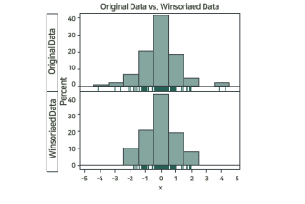

# 데이터전처리: 데이터 생성, 데이터 정제, 데이터변환, 결합

## 데이터 생성

### 요약변수
- 수집된 정보를 분석의 목적에 맞게 종합(aggregate) 한 변수
- 많은 모델에 공통으로 사용될 수 있어, 재활용성이 높음
    - 예: 단어 빈도, 상품별 구매 금액, 상품별 구매량, 영화 매출액 등

### 파생변수
- 특정한 의미를 갖은 작위적 정의에 의한 변수
- 사용자가 특정 조건을 만족하거나 특정 함수에 의해 값을 만들어 의미를 부여한 변수
- 주관적일 수 있으므로 논리적 타당성을 갖추어야 함
    - 예: 구매상품 다양성 변수, 가격 선호대 변수, 라이프 스타일 변수, 영화 인기도 변수

## 데이터 정제
### 결측값의 이해
- 기록누락, 미응답, 수집오류 등의 이유로 결측이 발생
- 결측값이 포함된 자료라도 나머지 변수의 값들은 의미있는 정보이므로, 정보의 손실을 최소화 하도록 결측을 처리하는 것이 바람직하다

### 결측값 처리법
- 완전제거법(list-wise deletion)
    - 결측값이 하나 이상 포함된 자료를 제거하는 방법
    - 정보의 손실로 분석 결과 왜곡 될 수 있음
        - 그래서 잘 사용 안함
- 평균대체법(mean value imputation)
    - 결측값은 해당 변수의 나머지 값들의 평균으로 대체하는 방법
    - 추정량은 표준오차가 과소추정되는 문제가 있음

- 핫덱대체법(hot deck imputation)
    - 동일한 데이터 내에서 결측값이 발생한 관찰치와 유사한 특성을 가진 다른 관찰지의 정보를 이용하여 대체하는 방법

- 그 밖의 결측값 처리법
    - Regression imputation, kNN imputation 등

### 이상값의 이해
- 이상값은 다른 데이터와 동떨어진 것
- 다른 자료값들에 비해 멀리 떨어져 있지만 의미가 있는 값일 수 있고,
단순히 입력 오류로 발생한 값 일 수 있음

### 이상값의 탐지
- 상자 그림

- 표준화 점수(Z-score)
    -  표준화 점수의 절댓닶이 2,3 보다 큰 경우 이상값으로 진단

### 이상값 처리방법
- 이상값 제외(trimming)
    - 처리는 간단, 정보손실이 발생하고 추정량 왜곡이 생길 수 있음

- 이상값 대체(winsorization)
    - 이상값을 정상값 중 최대 또는 최소 등을 대체하는 방식
    

- 변수변환
    - 자료값 전체에 로그변환, 제곱근 변환 등을 적용

### 연속형 자료의 범주화
- 변수구간화(binning)
    - 연속형 변수를 구간으로 이용하여 범주화 하는 과정

- 변수구간화의 효과
    - 이상치 문제를 완화
    - 결측치 처리 방법이 될 수 있음
    - 변수간 관계가 단순화 되어 분석 시 과적합 방지 및 결과 해석이 용이해짐

#### 데이터 전처리 과정
- 실제 분석에 들어가는 소요시간 보다 훨씬 많은 시간 및 노력 필요!
    - 데이터의 정보를 어떻게 하면 잘 살리면서 **분석에 용이한 형태** 로 만들 수 있을까? 등 고민하는 것 이 좋음

## 데이터 변환
- 자료 변환을 통해 자료의 해석을 쉽고 풍부하게 하기 위한 과정
- 데이터 변환 목적
    - 분포의 대칭화
    - 산포를 비슷하게 하기 위하여
    - 변수 간 관계를 단순하게 하기 위하여

- 오른쪽 꼬리가 긴 데이터 분포인 경우
    - 로그변환, 제곱근 변환

- 왼쪽 꼬리가 긴 데이터 분포인 경우
    - 지수 변환, 제곱변환

- 박스콕스 변환(Box-cox Transform)

## 데이터 결합
- 이너조인
    - 두 테이블에 키(key)가 공통으로 존재하는 레코드만 결합
- 풀아우터 조인
    - 두 테이블 중 어느 한쪽이라도 존재하는 키에 대한 레코드를 모두 결합
- 레프트 조인
    - 왼쪽 테이블에 존재하는 키에 대한 레코드를 결합
- 라이트 조인
    - 오른쪽 테이블에 존재하는 키에 대한 레코드를 결합

