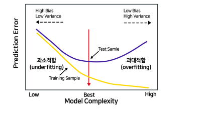

# 머신러닝 모델의 검증 및 평가
## 머신러닝 모델의 분석 절차
### 모델 기반 지도학습 알고리즘의 일반적인 분석 절차
- 주어진 데이터 전처리 및 탐색
- 적절한 모델 선택
- 주어진 데이터로 모델을 훈련시킴
- 훈련된 모델을 적용하여 새로운 데이터에 대한 예측을 수행

### 과대적합(overfitting)문제
- 주어진 자료는 거의 완벽한 예측이 가능하지만, 미래의 새로운 자료에 대한 예측력이 떨어지는 문제
- 복잡한 알고리즘을 사용하여 데이터를 훈련하는 경우 과대적합 문제를 항상 염두에 두어야 함

### 모델의 검증 및 평가 개요
- 모델 평가의 필요성
    - 과대적합을 막고 일반화 오차를 줄이기 위해서는 새로운 데이터에 얼마나 잘 일반화될지를 파악해야 함
    - 모델 적합에 사용된 자료를 평가를 위해 재활용하지 않고, 평가만을 위한 데이터를 확보할 필요가 있음

### 모델 검증 및 평가를 위한 데이터의 구분 : Hold-out 방식
- 주어진 자료를 다음의 세 그룹으로 랜덤하게 분할한 뒤, 주어진 목적에 따라 각각 모델의 훈련, 검증, 평가에 활용함
    1. 훈련 데이터(Training data)
        - 모델의 학습을 위해 사용되는 자료
    2. 검증 데이터(Validation data)
        - 훈련 자료로 적합되는 모델을 최적의 성능으로 튜닝하기 위해 사용되는 자료
        - 훈련에 필요한 하이퍼파라미터(hyperparameter)를 조정하거나, 변수선택(model selecting) 등에 이용
    3. 평가 데이터(Test data)
        - 훈련 및 검증 자료로 적합된 최종 모형이 미래에 주어질 새로운 자료에 대하여 얼마나 좋은 성과를 갖는지를 평가하는데 사용되는 자료

### 모델 검증 및 평가를 위한 데이터의 구분 : K-fold 교차검증(Cross-validation) 방식
- 자료의 수가 충분하지 않는 경우에는 훈련 데이터에서 너무 많은 양의 데이터를 검증 또는 평가 데이터에 뺏기지 않도록 교차 검정(cross-validation) 기법을 사용
    1. 자료를 균등하게 k개의 그룹으로 분할
    2. 각 j에 대하여 j번째 그룹을 제외한 나머지 k-1개 그룹의 자료를 이용하여 모델을 적합
    3. j번째 그룹의 자료에 적합된 모델을 적용한 뒤 예측오차를 구함
    4. j=1,....k에 대하여 위의 과정을 반복한 뒤, k개의 예측오차의 평균을 구함
    5. 예측오차의 평균값을 기준으로, 모델의 검증 또는 평가를 수행

## 일반화 오차 및 편향-분산 트레이드 오프
### 편향-분산 트레이드 오프(Bias-Variance Trade off)
- 모델의 복잡한 정도에 따라 훈련 데이터와 평가 데이터의 예측오차는 일반적으로 다음과 같은 패턴을 보이게 됨.

### 과대적합을 막기 위한 방법
- 훈련 데이터를 많이 확보
- 모델의 복잡도를 낮춤
    - 특성변수의 수를 줄이거나 차원축소
    - 파라미터에 규제(regularization)를 적용