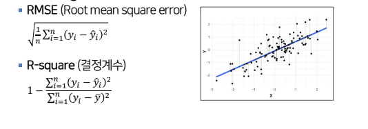
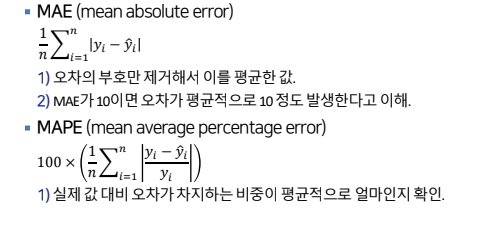
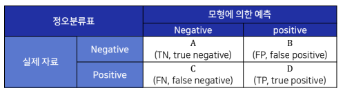
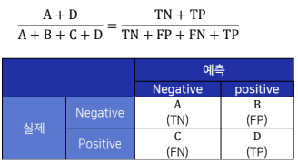
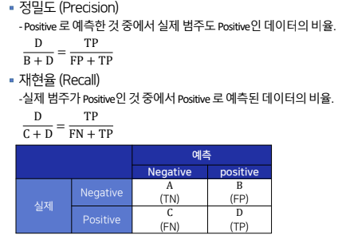
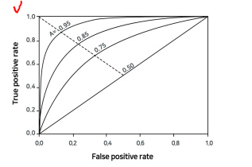

# 머신러닝 모델의 평가지표
## 지도학습 모델의 평가 지표
### 회귀(Regression) 모델의 평가 지표

- 정오분류표(confusion matrix)

- 정확도, 정분류율(Accuracy)
    - 전체 관찰치 중 정분류된 관찰치의 비중

    

- 정밀도(Precision)
    - Positive로 예측한 것중에서 실제 범주도 Positive인 데이터의 비율

- 재현율(Recall)
    - 실제 범주가 Positive 인 것 중에서 Positive로 예측된 데이터의 비율

    

- ROC(Receiver operating characteristic) 도표
    - 분류의 결정임계값(threshold)에 따라 달라지는 TPR(민감도, sensitivity)과 FPR(1-특이도, 1-specificity)의 조합을 도표로 나타냄
        1) TPR : True Positive Rate(=sensitivity(민감도)) 1인 케이스에 대해 1로 잘 예측한 비율
        2) FPR : False PositiveRate (=1-specificity(특이도))
        0인케이스에대해1로잘못예측한비율.
        3) 임계값이1이면FPR=0, TPR=0
        4) 임계값을1에서0으로낮춰감에따라FPR과TPR은동시에증가함.
        5) FPR이증가하는정도보다TPR이빠르게증가하면이상적.
            → 왼쪽위꼭지점에가까울수록좋음.
    
    

- AUC(Area Under the Curve)
    - Roc 곡선 아래의 면적
    - 가운데 대각선의 직선은 랜덤한 수준의 이진분류에 대응되며, 이 경우 AUC는 0.5임
    - 1에 가까울수록 좋은 수치. FPR이 작을 때 얼마나 큰 TPR을 얻는지에 따라 결정됨