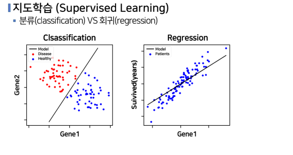
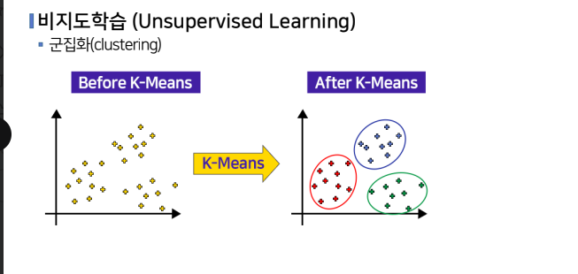
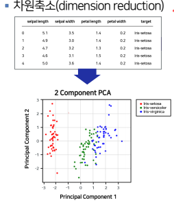
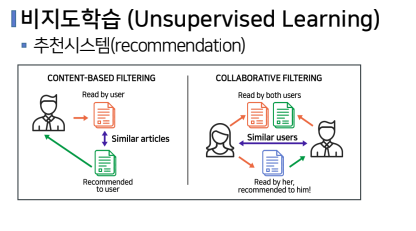

# 머신러닝의 기본 개념
## 머신러닝
- 컴퓨터 시스템에 명시적으로 프로그래밍 하지 않더라도 데이터를 스스로 학습하여 문제를 해결할 수 있게 하는 기술을 의미
- 사람이 인지하기 어려운 복잡한 규칙과 패턴을 파악하여 의미있는 결과를 얻을 수 있음

## 머신러닝의 발전
- 머신러닝 알고리즘이 발전되고, 컴퓨터의 성능의 발전, 대용량 데이터 축적 및 관리기술 발전됨에 따라 **머신러닝의 활용이 증가** 되고 있다

## 머신러닝 방법론의 분류
### 지도학습(Supervised Learning)
- 라벨이 있는 훈련용 데이터에서, 여러 특성변수를 이용하여 목표변수인 라벨(label) 을 예측하도록 모델을 학습함
- 라벨의 데이터 타입에 따라 라벨이 연속형이면,
    - `회귀(regression) 알고리즘`
- 라벨이 범주형이면,
    - `분류(classfication) 알고리즘`
- 대표적인 알고리즘
    - Linear Regression, K-nearest Neighbors, Logistic Regression, Softmax Regression
        - 분류 알고리즘
    - Decision Tree, Svm, Random Forest, Boosting, Neural Network, Deep Learning
        - 분류/회귀 알고리즘

### 비지도 학습
- 라벨이 없는 훈련용 데이터에서 특징 변수들 간의 관계나 유사성을 기반으로 의미있는 패턴을 추출
- 자율학습 이라고 함
- 군집화(clustering), 차원축소(dimention reduction), 추천시스템(recommendation) 등에 활용됨
- 대표 알고리즘
    - k-means Clustering, Hierarchical Clustering, PCA, t-SNE, Apriori, Auto-Encoders
#### 군집화

#### 차원축소

- 데이터가 너무 많을 때 이것들을 시각화하면 패턴을 파악하기에 좋고, 혹은 모델링 할 때 변수의 구조가 단순한게 좋은건데 특성 변수가 많으면 문제를 발생시킬수 있어 이 특성 변수의 차원을 압축시키되, 가능한 한 많은 정보를 포함하면서 압축되도록 하는 것!
    - 예측력 ↑, 데이터 해석이 풍부해짐, 모델링에서 기초적인 정보를 얻을 수 있다

#### 추천 시스템

#### 강화 학습(Reinforcement Learning)
- 행동하는 주체(agent)가 있고 행동을 했을 때의 상태(state)와 보상(reward)을 바꿔주는 환경(environment)으로 구성됨
- 주체가 매번 어떠한 행동(action)을 하면 환경에 의해 상태와 보상이 바뀌면서 주체는 보상이 가장 커지는 방향으로 계속 학습해 나가게 됨
- 대표 알고리즘
    - SARSA, Q-Learning
- 알파고, 자율주행에 많이 사용되는 알고리즘
