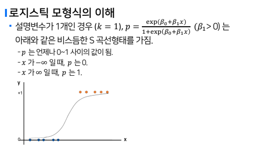
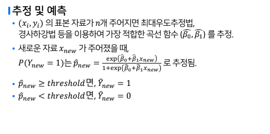
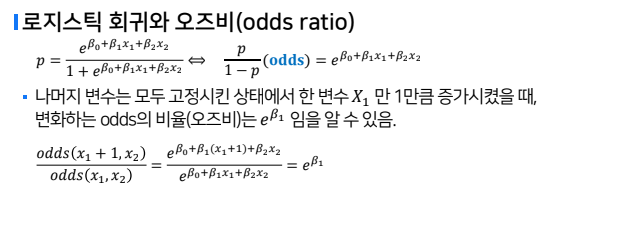
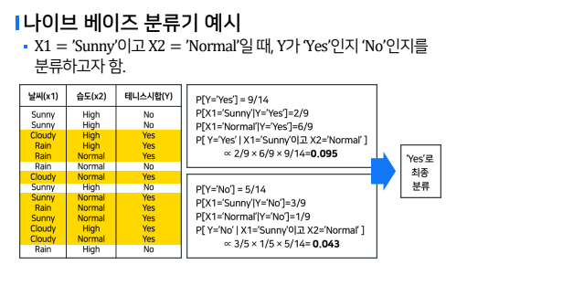

# 분류

## 분류 : 로지스틱 회귀(Logistic Regression)

### 로지스틱 회귀모형 개요
- 로지스틱 회귀분석은 선형 회귀분석과 달리 반응 변수가 범주형 데이터인 경우에 사용되는 기법
- 새로운 설명 변수의 값이 주어질 때 반응변수의 각 범주에 속할 확률이 얼마인지를 추정하고, 추정확률을 분류 기준값에 따라 분류하는 목적으로 사용됨

### 이항 로지스틱 회귀모형
- 이진(0/1)형 값을 가지는 반응변수를 여러 설명변수를 이용하여 회귀식의 형태로 예측하는 모형

    

- 범주형 반응변수의 범주가 두 개일 때, 관심범주를 1, 다른 범주를 0으로 정의하면, 반응변수 Y는 관심범주에 속할 확률이 p인 베르누이 확률분포를 따르는 것으로 볼 수 있음

- `Pr(Y=1) = p` , `Pr(Y=0)= 1-p`
- 여기서 확률 p를 독립변수의 함수로 설명하고자 함
- 학률p은 0과 1사이의 값이므로, 음의무한대 부터 양의무한대 범위를 가지는 독립변수의 선형함수로 나타낼 수 없음

- 로지스틱 모형식의 이해
    - 확률 p 대신 로그오즈(log(p/1-p))를 독립변수의 선형함수로 나타낸 것
    - 

- 추정 및 예측
    - 

- 로지스틱 회귀모형의 분리경계면
    - 선형의 결정경계를 가짐
    - 독립변수 2개인 로지스틱 회귀모형과 threshold=0.5 일 때의 초평면(Hyperplane)

- 로지스틱 회귀와 오즈비(odds ratio)
    - 
    - x1 만 1만큼 증가하면, 성공(관심변주, Y=1)에 대한 오즈가 exp(B1) 배 변화함
        - B1 > 0 : 관심변주에 속할 확률이 증가함
            - X1 변수와 관심변주 간에는 양의 상관관계
        - B1 < 0 : 관심변주에 속할 확률이 감소함
            - X1 변수와 관심변주 간에는 음의 상관관계

## 분류 : 나이브베이즈(Naive Bayes)
- 특성변수가 주어졌을 때, Y범주의 확률계산에 베이즈 정리를 이용
- 모든 특성변수가 독립이라는 가정이 단순함`(나이브베이즈 단점)`
- 좋은 예측력 가짐
- 활용범위 높음
- 데이터가 많아도 빠름
- 데이터가 적을 때 실패 가능성 적음(좋은 성능을 보이는 편)
- 

## 분류 : KNN(K-nearest Neighbor) Classifier

- KNN 알고리즘
    - 가장 간단한 지도학습 머신러닝 알고리즘
    - 훈련 데이터를 저장해두는 것이 모델을 만드는 과정의 전부
    - 새로운 데이터가 입려되면 그 새로운 데이터 주변의 가장 가까운 K개의 훈련데이터의 레이블 확인한 뒤, 가장 많이 보이는 라벨로 분류하는 방법
    
- 거리 : 유클리디안, 멘해튼, 민코우스키

- 이상적인 K를 결정하는 것이 매우 중요함
    - k가 크면 과대적합, 작으면 과소적합

- 거리의 측정
    - 자료에 스케일 차이가 있는 경우, 스케일이 큰 특성변수에 의해 거리가 결정되어 버릴 가능성 있음.
        - 따라서, 각 특성변수 별로 스케일이 유사해 지도록 표준화 변환(Z score) 또는 min-max 변환으로 스케일링을 해준 뒤 거리를 재는 것이 적절함.