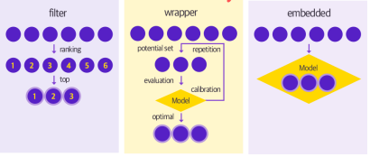
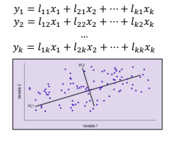
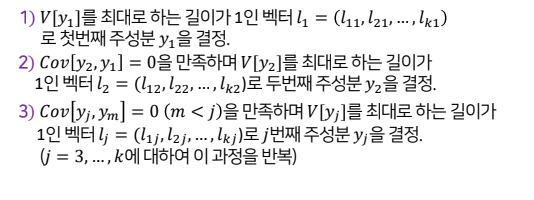
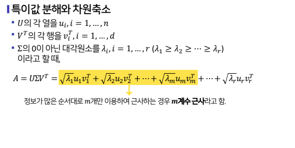

# 특성공학
## 특성 공학 개요, 특성 선택(Feature Selection) 방법론
### 특성공간 차원축소의 필요성
- 모델의 해석력 향상
- 모델 훈련시간의 단축
- 차원의 저주 방지
    - 차원의 저주란?
        - 데이터 용량이 커지면서 불필요한 샘플이 많아지는 것
- 과적합(overfitting)에 의한 일반화 오차를 줄여 성능 향상

### 특성공학 방법론은 크게 특성 선택(feature selection) 방법과 특성 추출(feature extraction) 방법으로 구분할 수 있음

### 특성 선택(feature selection)
- 주어진 특성 변수들 가운데 가장 좋은 특성 변수의 조합만 선택함
- 불필요한 특성 변수를 제거함
- Filtering, Wrapper, Embedded 방식으로 분류할 수 있음

### Filter 방식 : 각 특성 변수를 독립적인 평가함수로 평가함
- 각 특성변수 X와 목표변수 Y 와의 연관성을 측정한 뒤, 목표변수를 잘 설명할 수 있는 특성변수만을 선택하는 방식
- X와 Y의 1:1 관계로만 연관성을 판단
- 연관성 파악을 위해 t-test, chi-square test, information gain 등의 지표가 활용됨

### Wrapper 방식 : 학습 알고리즘을 이용
- 다양한 특성변수의 조합에 대해 목표변수를 예측하기 위한 알고리즘을 훈련하고, cross-validation 등의 방법으로 훈련된 모델의 예측력을 평가함. 그 결과를 비교하여 최적화된 특성변수의 조합을 찾는 방법
- 특성변수의 조합이 바뀔 때마다 모델을 학습함
- 특성변수에 중복된 정보가 많은 경우 이를 효과적으로 제거함
- 대표적인 방법으로는 순차탐색법인 foward selection, backward selection, stepwise selection 등이 있음

### Filter 와 Wrapper 의 장단점 비교
- Filter 장점
    - 계산비용이 적고 속도가 빠름
- Filter 단점
    - 특성 변수간의 상호작용을 고려하지 않음
- Wrapper 장점
    - 특성변수 간의 상호작용을 고려함
    - 주어진 학습 알고리즘에 대해 항상 최적의 특성변수 조합을 찾음
- Wrapper 단점
    - 모델의 학습해야 하므로, 계산비용이 크고 속도가 느림
    - 과적합(overfitting)의 가능성 있음

### Embedded 방식 : 학습 알고리즘 자체에 feature selection 을 포함하는 경우
- Wrapper 방식은 모든 특성변수 조합에 대한 학습을 마친 결과를 비교하는데에 비해, Embedded 방식은 학습과정에서 최적화된 변수를 선택한다는 점에서 차이가 있음
- 대표적인 방법으로는 특성변수에 규제를 가하는 방식인 Ridge, Lasso, Elastic net 등이 있음

## 특성 추출(Feature Extraction) 방법론
### 특성 공학
- 특성공간 방법론
    - 특성 선택(feature selection) : 가지고 있는 특성 중 더 유용한 특성을 선택
    - 특성 추출(feature extraction) : 가지고 있는 특성으 결합하여 더 유용한 특성을 생성

- 주요 특성 추출법
    - PCA(Principal component analysis)
    - SVD(Singular Value Decomposition)
    - LDA(Linear discriminant analysis)
    - NMF(Non-negative matrix factorization)
    - PCA와 CVD를 가장 많이 사용함!

## 주성분 분석(PCA)
### 주성분 분석이란?
- 서로 연관되어 있는 변수들(x1,...xk)이 관찰되었을 때, 이 변수들이 전체적으로 가지고 있는 정보들을 최대한 확보하는 적은 수의 새로운 변수(주성분, PC)를 생성하는 방법

### 주성분 분석의 목적
- 자료에서 변동이 큰 축을 탐색함
- 변수들에 담긴 정보의 손실을 최소하하면서 차원을 축소함
- 서로 상관이 없거나 독립적인 새로운 변수인 주성분을 통해 데이터의 해석을 용이하게 함

### 주성분 분석의 아이디어
- k개의 특성변수 x1,....xk의 주성분이, y1,....,yk 라면 이들은 x1,...,xk의 선형결합식으로 아래와 같이 표현된다

    

    

### 주성분 분석에 관한 기하하적 의미
- 주성분 축은 원래 변수들의 좌표축이고 직교 회전 변환된 것으로 해석할 수 있음
    1. 주성분 축은 데이터의 변동이 가장 커지는 축
    2. 주성분 축은 첫번째 주성분 축과 직교하면 첫번째 주성분 축 다음으로 데이터의 변동이 큰 축을 나타냄
    - 각 관찰치 별 주성분 점수는 대응하는 원 자료 값들의 주성분 좌표축에서의 자표값에 해당함
    - 자료들의 공분산 행렬이 대각행렬이 되도록 회전한 것을 해석 할 수 있음

## 특성값 분해(SVD)
### 특성값 분해 이론(선형대수 지식 필요)

### 특성값 분해와 차원축소

### 주성분분석(PCA)와 특성값분해의 관계
- A의 오른쪽 특성벡터는 A의 공분산행렬의 고유벡터와 동일함
- 자료 행렬에 대한 특성값 분해로 주성분을 도출 가능

#### 요약
- 특성 선택에 관한 방법
    - Filter 방식
        - 1:1 비교
        - 모델 훈련하지 않음
        - 속도 빠름
    - Wrapper 방식
        - 다 : 1 비교
        - 상호작용 반영 모델 훈련함
    - Embedded 방식
        - 특성 변수 파라미터 규제를 가함

- 특성압축
    - 기존 특성 변수들을 결합하여, 더 유용한 새로운 특성변수를 만드는 방식
- PCA, SVD등의 방법
    - 이론적 이해를 위해서는 선형대수 지식 필요!

