# 회귀분석

## 단순회귀분석(Simple Linear Regression)

### 회귀분석 개요

#### 회귀분석
- 독립변수와 종속변수 간의 함수적인 관련성을 규명하기 위하여 어떤 수학적 모형을 가정하고, 이 모형을 측정된 자료로부터 통계적으로 추정하는 분석방법

- y=f(x) 의 함수 관계가 있을 때,
    - x를 설명변수(explanatory variable) 또는 독립변수(independent variable)
        - 단순 회귀 : 독립변수가 1개
        - 다중 회귀 : 독립변수가 2개 이상
    - y를 반응변수(response variable) 또는 종속변수(dependent variable)

### 단순선형회귀모형

#### 모형 정의 및 가정
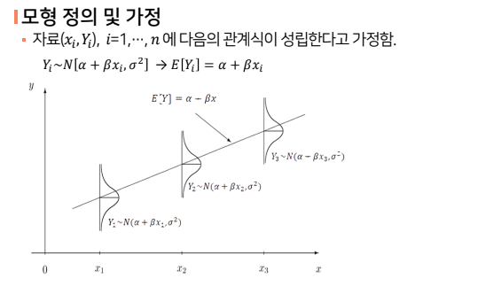

#### 모수 추정
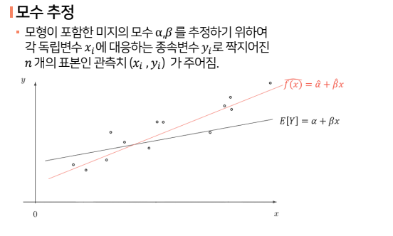

#### 최소제곱법
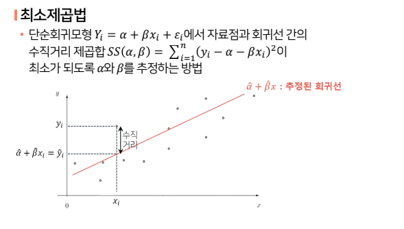

#### 모형의 유의성 t검정
- 독립변수 x가 종속변수 Y를 설명하기에 유용한 변수인가에 대한 통계적 추론은 회귀계수 B(베타) 에 대한 검정을 통해 파악 가능

- 가설
    - Ho : B = 0
    - H1 : B != 0

#### 모형의 유의성 t검정
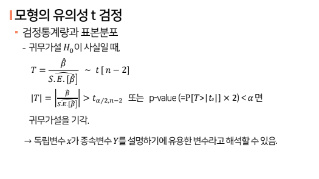

#### Y의 변동성 분해
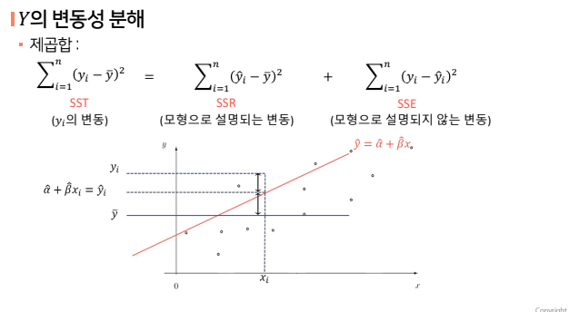

#### 모형의 적합성
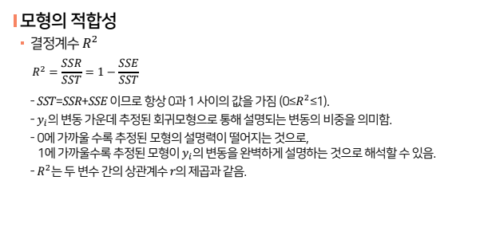

##### 단순회귀분석 요약
- 모형의 정의
    - 하나의 독립변수 X로 하나의 종속변수 Y를 설명, Y는 연속형 숫자의 변수

- 모형 식
    - Y의 기댓값을 X의 직선함수로 표현

- 모수 추정
    - 최소 제곱법

- 모수에 관한 검정
    - 모수 B(베타)가 0인지 여부에 관한 t검정

- 모형의 적합도
    -  결정계수 (R-squared)

## 다중회귀분석(Multiple Linear Regression)

### 다중선형회귀모형

#### 다중선형회귀모형으로의 확장
- 다중 선형회귀모형
    - 독립변수가 두 개 이상인 선형회귀모형
    - 여러 개의 독립변수를 이용하면 종속변수의 변화를 더 잘 설명할 수 있을 것임
    - 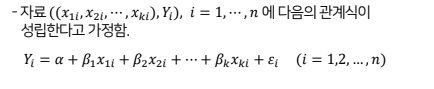
    - 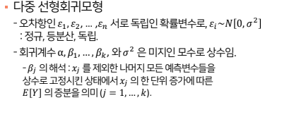

#### 회귀계수 a, B1, ...., Bk의 추정(a=알파, b=베타)

### 범주형 독립변수가 포함된 회귀모형

#### 범주형 독립변수가 포함된 회귀모형
- 범주형 독립변수를 회귀모형에 포함하기 위해서는 더미변수(dummy variable) 기법을 사용
- 더미변수 0 또는 1의 값을 갖는 변수
- 더미변수의 개수 = 범주의 개수 - 1
- 범주형 독립변수 예시 : 중고차 가격에 관한 예측모형
    - 중고차 시장에서 차량의 주행거리와 색상이 차량의 가격에 어떤 영향을 미치는지를 파악하고자 2013년형 A브랜드 중고차 100대에 관한 자료를 수집
    - 종속변수 : Price(가격)
    - 독립변수 : Odometer(주행거리)
    - Color(차량색상, 범주형:white/silver/other)
    - color의 더미변수 : 범주의 수가 3개
        - 2개의 더미변수(D1, D2)를 생성
            - D1 = {1 white인경우, 0 white가 아닌 경우}
            - D2 = {1 silver인경우, 0 silver가 아닌 경우}
        - Other인 경우 : D1=0 & D2=0

- 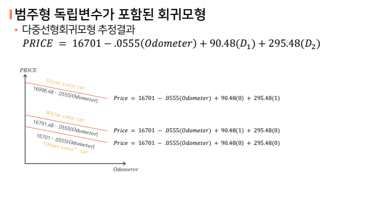

##### 다중회귀분석 요약
- 다중선형회귀모형
    - 독립변수가 두 개 이상인 선형회귀모형
    - 오차가정: 정규, 등분산, 독립
    - 회귀 계수 베타 해석: partial effect 범주형 독립변수가 포함된 회귀 모형
    - 범주형 독립변수를 회귀모형에 포함하기 위해서는 더미변수 기법 사용
    - 더미변수의 개수 = 범주의 개수 - 1

## 다중회귀분석(변수선택)

### 다중회귀모형의 변수선택

#### 다중회귀모형의 변수선택 개요
- 가능한 적은 수의 설명변수로 좋은 예측력을 가지는 모형을 찾고자 함
- 변수선택법
    - 전진선택법(foward selection)
    - 후진제거법(backward elimination)
    - ⭐단계선택법(stepwise method)⭐
    - 모든 가능한 조합의 회귀분석 : 모든 가능한 독립변수들의 조합에 대한 회귀모형을 생성한 뒤 가장 적합한 회귀모형을 선택

### 전진선택법, 후진제거법, 단계선택법

#### 변수 선택 방법
- 전진선택법(foward selection)
    - 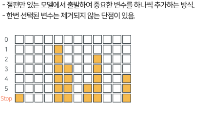

- 후진제거법(backward elimination)
    - 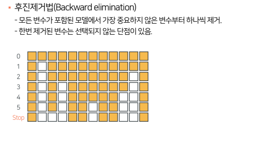

- ⭐단계선택법(stepwise method)⭐
    - 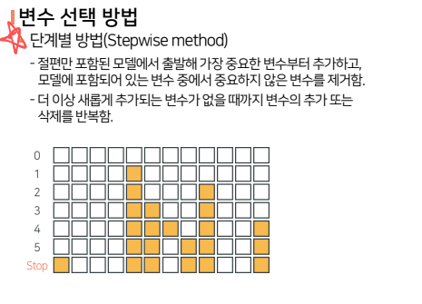

### 모형 선택의 기준

- 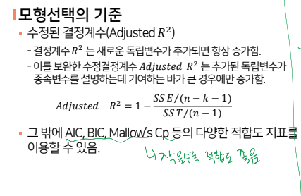

## 다중회귀분석(잔차분석, 다중공선성)

### 가정 위반 검토 및 해결

#### 다중회귀모형의 가정 위반 검토 및 해결
- 잔차분석
    - 회귀 모형에서의 가정이 적절한 것인가에 대한 평가
        1. 오차의 정규성
        2. 오차의 등분산성
        3. 오차의 독립성
    - 오차는 확률변수로 관찰되지 않는 값이므로, 각 오차에 대응되는 잔차를 관찰한 뒤 잔차들의 분포를 통해 오차에 대한 가정의 적정성을 확인 할 수 있음
- 잔차분석 방법
    - 각 가정 별로, 검정을 통한 방법과 그래프를 통한 시각적인 확인 방법이 가능

    - **시각적 방법을 이용한 경우**
        - 오차의 정규성 위반 : 히스토그램, QQ플롯
        - 오차의 등분산성/독립성 : 잔차산점도

#### 다중회귀모형의 가정위반 검토 및 해결
- QQ플롯을 이용한 오차의 정규성 검토
    - 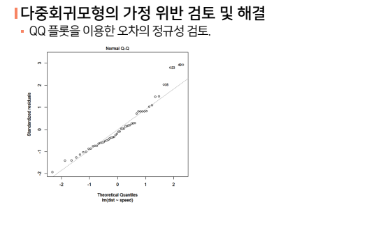

- 잔차산점도를 이용한 오차의 독립성, 등분산성 검토
    - 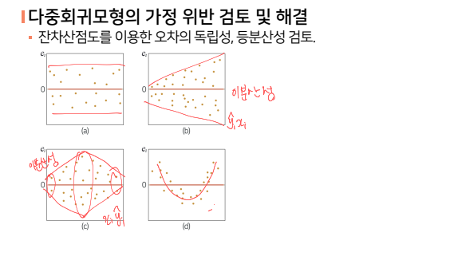

- 가정 위반 시 해결방안
    - 오차의 정규성 위반 : 변수변환
    - 오차의 등분산성 : 가중최소제곱회귀
    - 오차의 독립성 : 시계열 분석

### 다중공선성 진단 및 해결

#### 다중공선성
- 다중공선성이란?
    - 독립변수들 간에 강한 선형관계가 존재하는 경우
    - 다중회귀모형 분석 시 자주 발생하는 문제 중 하나임
    - 다중회귀모형에서 회귀계수 추정에 부정적인 영향을 미침
        1. 개별적인 회귀계수 추정의 신뢰성이 떨어져 추정치를 믿을 수 없게 만듬
        2. 전반적인 모형의 적합성이나 정확도는 크게 변하지 않음

- 다중공선성 진단방법 
    - VIF 계수가 5 또는 10이상인 경우 다중공선성이 심각한 것으로 봄

- 다중공선성 해결책
    - 변수선택으로 중복된 변수제거
    - 주성분 분석 등을 이용하여 중복된 변수를 변환하여 새로운 변수 생성
    - 릿지, 라쏘 등으로 중복된 변수의 영향력을 일부만 사용

## 규제가 있는 선형회귀모델(Ridge, Lasso, Elastic Net)

### 규제가 있는 선형회귀모델

#### 선형회귀모델의 규제
- 모형의 과대적합을 막기 위한 규제 방법(regularization)으로 선형회귀모형에서는 보통 모델의 가중치를 제한하는 방법을 사용함

- 비용함수 + 가중치(계수)에 대한 제약(L1, L2, L1+L2)

- 추정량의 분산을 떨어뜨려 일반화 오차가 줄어드는 효과를 기대

- 적절한 하이퍼 파라미터 선택이 필요

- 가중치를 제한하는 방법에 따른 규제 선형회귀모델의 종류
    - 릿지회귀(Ridge Regression)
    - 라쏘회귀(Lasso Regression)
    - 엘라스틱넷(Elastic Net)

#### 릿지회귀와 라쏘회귀의 특징
- 두 방식 모두 추정치는 일반선형회귀모형과는 달리 편의가 발생하지만, 분산은 더 작아지게 됨.
    
    → λ에 따라 일반화오차가 더 작아질 수 있음.

- 라쏘 회귀의 경우 제약 범위가 각진 형태
    
    → 파라미터의 일부가 0이 되는 경향이 있음. (sparse model)

- 릿지 회귀의 경우 제약 범위가 원의 형태

    → 파라미터가 0이 되지 않고 전반적으로 줄어드는 경향이 있음.

#### 엘라스틱 넷(Elastic Net)
- L1과 L2 규제를 혼합한 방식.
- 릿지회귀와 라쏘회귀의 장점을 모두 가짐.